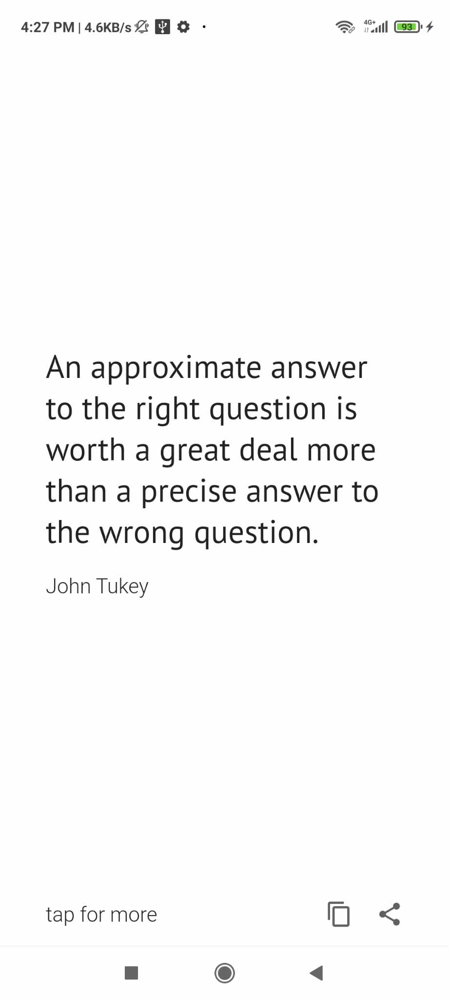
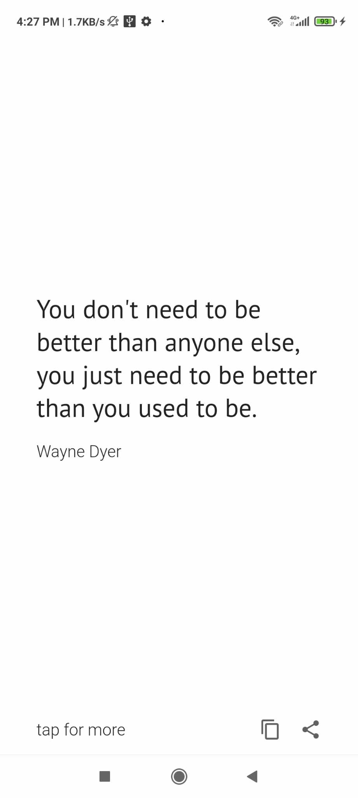
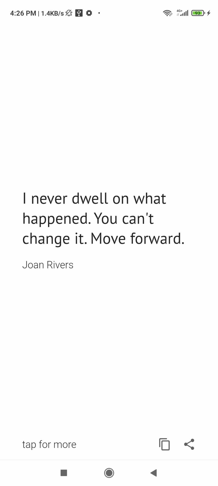

# Quotes App - README

## Overview

The **Quotes App** is a Flutter-based mobile application that retrieves random motivational quotes from the ZenQuotes API. The app allows users to view quotes, copy them to the clipboard, and share them with others via a screenshot. 

The app uses various Flutter packages such as:
- `http` for API requests
- `path_provider` for saving screenshots
- `screenshot` for capturing and sharing quotes as images
- `skeletonizer` for displaying skeleton loaders while content is loading
- `share_plus` for sharing quotes and images

---

## Features

1. **Random Quote Generator**: Fetch a random quote from the ZenQuotes API.
2. **Copy to Clipboard**: Copy the displayed quote and author to the clipboard with a single tap.
3. **Share Quote**: Share the quote with others as an image file using the `Share` feature.
4. **Skeleton Loading Effect**: Displays a skeleton loader while fetching the quotes.
5. **Edge-to-Edge UI**: The application runs in full-screen mode with a minimalistic user interface.

---

## Usage

1. **Tap for New Quotes**: On the main screen, tap the "tap for more" text to fetch a new random quote from the ZenQuotes API.
2. **Copy the Quote**: Click on the copy icon to copy the quote text along with the author’s name.
3. **Share the Quote**: Tap on the share icon to capture a screenshot of the quote and share it using any installed sharing apps.
4. **Skeleton Loader**: While fetching quotes, a loading skeleton is displayed to enhance the user experience.

---

## Code Breakdown

### Main Components

- **`MyHomePage` Widget**: This widget contains the core logic for fetching and displaying quotes, handling screenshot capture, and sharing functionality.

- **`getQuote` Method**: Fetches a random quote from the ZenQuotes API. Handles the loading state and errors gracefully.

- **`copyTextToClipboard` Method**: Copies the quote and author to the device clipboard and shows a snackbar confirming the action.

- **`shareQuote` Method**: Captures a screenshot of the quote and shares the image using the `share_plus` package.

---

## Screenshots

Here are some visual examples of the app in action:

### Quote Display
  

---

## Dependencies

Below is a list of packages used in this project:

- [`http`](https://pub.dev/packages/http): To make HTTP requests to the ZenQuotes API.
- [`path_provider`](https://pub.dev/packages/path_provider): To access the device file system for saving screenshots.
- [`screenshot`](https://pub.dev/packages/screenshot): To capture screenshots of the quote view.
- [`share_plus`](https://pub.dev/packages/share_plus): To share screenshots or text.
- [`skeletonizer`](https://pub.dev/packages/skeletonizer): To provide a skeleton loading effect.

---

## How to Contribute

1. Fork the repository.
2. Create a new branch.
3. Make your changes and commit them.
4. Push the branch to your forked repository.
5. Create a pull request for review.

